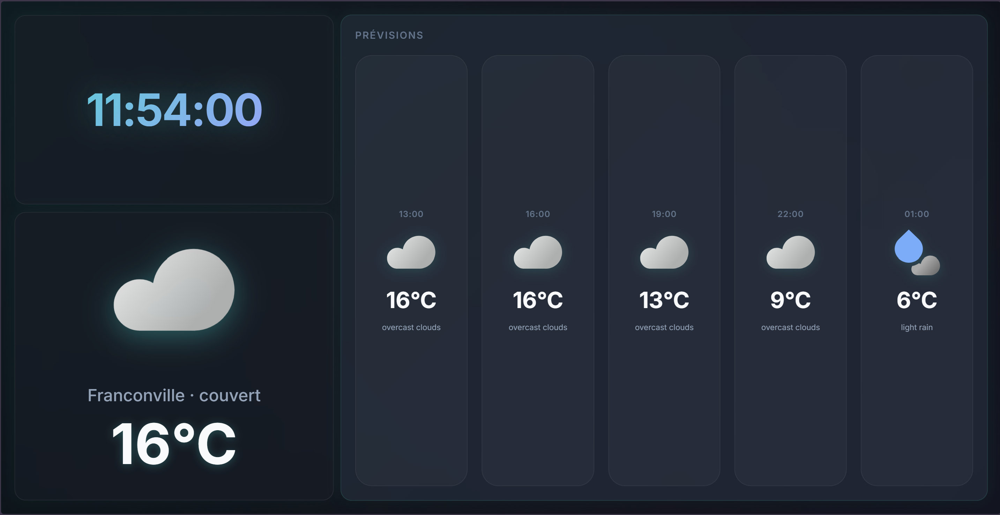
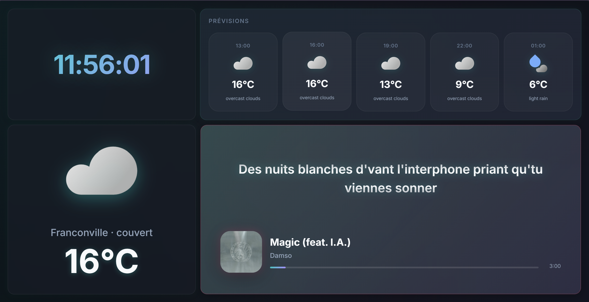
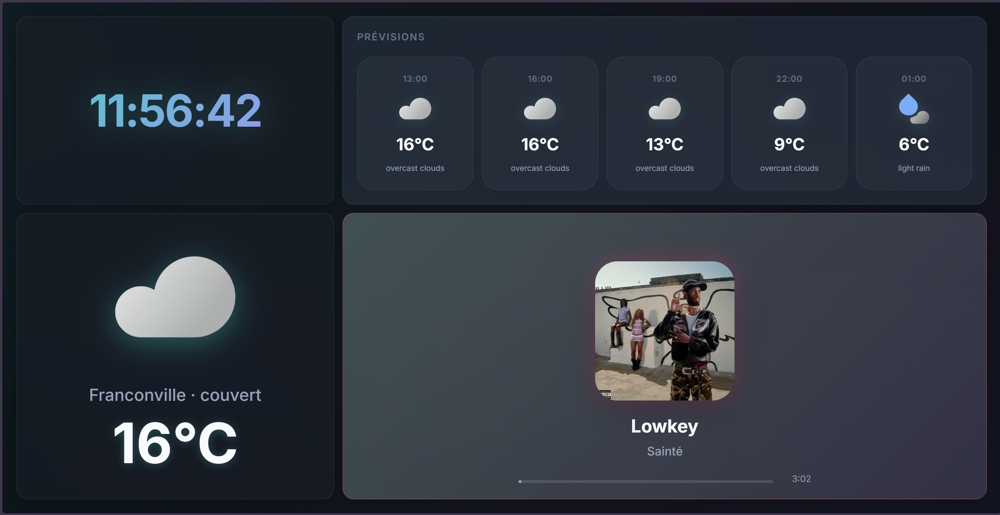

# Tab Screen

Dashboard temps réel affichant météo, prévisions et lecteur de musique avec paroles synchronisées.

## Captures d'écran

### Vue principale



### Lecteur avec paroles



### Mode plein écran



## Fonctionnalités

### Lecteur de musique enrichi

- Affichage des informations de lecture (titre, artiste, pochette)
- **Paroles synchronisées en temps réel** avec défilement automatique
- Cache persistant des paroles (compression gzip)
- Animation d'attente organique avant les premières paroles
- Mode plein écran automatique quand pas de paroles
- Transitions fluides et morphing entre les modes
- Extraction automatique de la couleur dominante de la pochette
- Placeholder SVG élégant si pochette introuvable
- Barre de progression animée

### Météo et prévisions

- Météo actuelle avec température et description
- Prévisions sur les 5 prochaines heures
- Icônes météo Material Design animées
- Mise à jour automatique toutes les 30 minutes

### Horloge

- Affichage de l'heure en temps réel
- Option d'affichage des secondes
- Design gradient animé

### Interface utilisateur

- Design moderne glassmorphism
- Animations fluides et organiques
- Thème sombre adaptatif
- Responsive (desktop, tablette)
- Support du mode réduit des animations (accessibilité)

## Vue d'ensemble

L'écran principal est divisé en 4 zones :

- **Heure** : Grande horloge avec gradient animé
- **Météo actuelle** : Température et conditions
- **Prévisions** : Timeline des prochaines heures
- **Musique** : Lecteur avec paroles synchronisées

## Installation

### Prérequis

- Node.js 16+
- npm ou yarn
- Clés API (voir Configuration)

### Étapes

```bash
# Cloner le projet
git clone <votre-repo>
cd tab-screen

# Installer les dépendances
npm install

# Créer le fichier de configuration
cp .env.example .env

# Éditer .env avec vos clés API
nano .env

# Démarrer le serveur
npm start
```

Le serveur démarre sur `http://localhost:3000`

## Configuration

Créez un fichier `.env` à la racine du projet :

```env
PORT=3000
OPENWEATHER_API_KEY=votre_clé_openweather
LASTFM_API_KEY=votre_clé_lastfm
```

### Obtenir les clés API

- **OpenWeather** : [openweathermap.org/api](https://openweathermap.org/api)
- **Last.fm** : [last.fm/api/account/create](https://www.last.fm/api/account/create)

**Note** : Les paroles sont récupérées via lrclib.net (pas de clé requise)

### Configuration avancée

Dans `server.js`, vous pouvez modifier :

```javascript
const VILLE = "Franconville"; // Ville pour la météo
const VILLE_SHORT = "Franconville"; // Nom affiché
```

Dans `public/screen.html`, ajustez :

```javascript
const config = {
  showTime: true,
  showWeather: true,
  showForecast: true,
  showSeconds: true,
  lyricsDelaySeconds: +1, // Délai de sync des paroles
};
```

## Utilisation

### Interface principale

- **`/`** : Page d'accueil avec simulateur de musique
- **`/screen`** : Écran d'affichage principal
- **`/cache`** : Interface de gestion du cache de paroles

### Envoi de musique

#### Via API (pour Tasker, scripts, etc.)

```bash
curl -X POST http://localhost:3000/api/music \
  -H "Content-Type: application/json" \
  -d '{
    "title": "Numb",
    "artist": "Linkin Park",
    "position": 0,
    "duration": 185
  }'
```

#### Via interface web

1. Ouvrir `http://localhost:3000`
2. Remplir le formulaire de simulation
3. Cliquer sur "Envoyer la simulation"

### Endpoints API

| Endpoint                  | Méthode | Description                                   |
| ------------------------- | ------- | --------------------------------------------- |
| `/api/weather`            | GET     | Météo actuelle                                |
| `/api/forecast`           | GET     | Prévisions (5h)                               |
| `/api/music`              | POST    | Envoyer infos musique                         |
| `/api/lyrics`             | GET     | Récupérer paroles (params: `track`, `artist`, `album` optionnel) |
| `/api/lyrics-cache`       | GET     | Liste du cache                                |
| `/api/lyrics-cache/:file` | GET     | Détails d'une entrée                          |

## Structure du projet

```
tab-screen/
├── public/
│   ├── index.html          # Interface de simulation
│   ├── screen.html         # Écran d'affichage principal
│   ├── cache.html          # Gestion du cache
│   ├── js/
│   │   └── cache.js        # Script cache UI
│   └── weather-icons/      # Icônes météo SVG
├── services/
│   └── lyricsCache.js      # Service de cache des paroles
├── cache/
│   └── lyrics/             # Fichiers .gz de cache
├── server.js               # Serveur Express + Socket.IO
├── package.json
├── .env                    # Configuration (non versionné)
└── README.md
```

## Technologies

### Backend

- **Node.js** + Express 5
- **Socket.IO** : Communication temps réel
- **node-fetch** : Requêtes HTTP
- **zlib** : Compression gzip du cache

### Frontend

- **HTML5** / CSS3 (Grid, Flexbox, Backdrop Filter)
- **Vanilla JavaScript** (pas de framework)
- **Socket.IO Client**
- **ColorThief** : Extraction couleurs dominantes

### APIs externes

- **OpenWeather** : Météo et prévisions
- **Deezer** : Récupération pochettes album
- **Last.fm** : Fallback pochettes
- **lrclib.net** : Paroles synchronisées

## Fonctionnalités avancées

### Cache intelligent des paroles

- Compression gzip (économie d'espace ~70%)
- Persistance illimitée
- Gestion automatique des variantes (feat., ft.)
- Minification des fichiers LRC

### Synchronisation des paroles

- Parsing format LRC avec timestamps
- Défilement centré sur la ligne active
- États visuels (active, past, near)
- Animation d'intro organique
- Délai configurable pour compensation latence

### Animations

- FLIP (First Last Invert Play) pour transitions fluides
- Morphing entre modes normal/fullscreen
- Fade croisé lors du changement de musique
- Respiration des cartes
- Orbite organique des points d'attente

## Sécurité

- Les clés API ne sont jamais exposées côté client
- Validation des entrées sur les endpoints
- Pas de logs sensibles dans la console
- Cache en lecture seule côté public

## Contribuer

Contributions bienvenues via issues et pull requests.

## Licence

ISC

## Auteur

Mattia

---

Projet personnel - Respecter les limites d'utilisation des APIs tierces.
